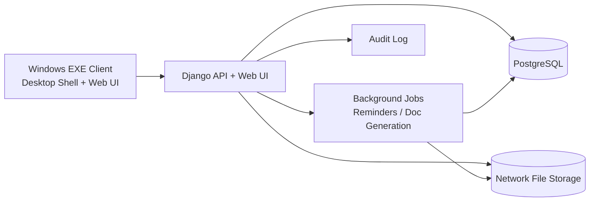

# Architecture (VOLPAS Forms Platform)

## 1. Цель
Система — **надстройка над действующими формами лаборатории** (Форма 1–5), без LIMS-функциональности и без привязки к области аккредитации.

## 2. Логическая архитектура

## 3. Компоненты
1. **Desktop Client (Windows EXE)**
   - Контейнер для UI (webview-shell).
   - Авторизация пользователя.
   - Открытие реестров/карточек/печати.

2. **Backend (Django + DRF)**
   - CRUD по Формам 1–5.
   - Реестр шаблонов и версии шаблонов.
   - Генерация печатных форм DOCX/XLSX.
   - Архив сгенерированных документов.
   - RBAC, аудит, soft delete.

3. **PostgreSQL**
   - Основные сущности и история изменений.
   - Аудит действий и входов.

4. **File Storage (локальная сеть)**
   - Вложения карточек.
   - Бинарники шаблонов.
   - Сгенерированные документы.

5. **Backup/Restore**
   - Бэкап БД (pg_dump).
   - Бэкап файлового хранилища.
   - План восстановления.

## 4. Развертывание
- **Dev**: Docker Compose (app + db).
- **Prod (Windows-first)**:
  - Django-сервис в локальной сети.
  - PostgreSQL на сервере лаборатории.
  - Файловая шара (SMB).
  - Desktop EXE на рабочих местах.

## 5. Нефункциональные требования
- Время отклика реестров: < 2 сек для типовых фильтров.
- Надежная генерация документов с сохранением верстки шаблона.
- Полная трассируемость: кто/когда/что изменил и что распечатал.
- Постепенное внедрение без остановки текущей работы.

## 6. Что исключено из области решения
- LIMS-процессы (пробы, маршрутизация, протоколы испытаний).
- Связь с областью аккредитации.
- Приборные интеграции и сложная лабораторная аналитика.
