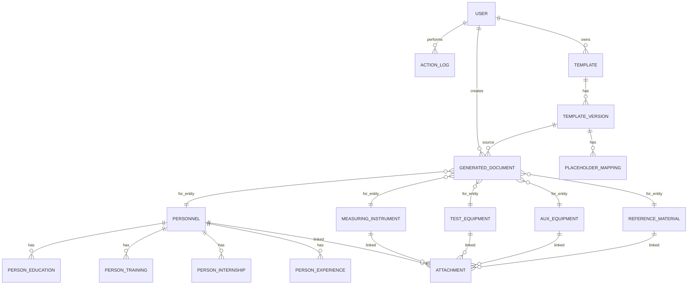

# ER-модель

## Ключевые сущности
- `personnel` (Форма 1)
- `measuring_instrument` (Форма 2)
- `test_equipment` (Форма 3)
- `aux_equipment` (Форма 4)
- `reference_material` (Форма 5)
- `template`, `template_version`, `placeholder_mapping`
- `generated_document` (архив печатных форм)
- `attachment` (вложения)
- `action_log` (аудит)
